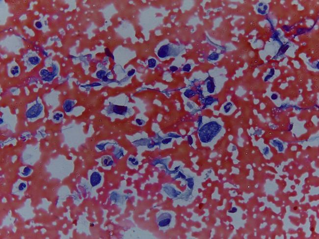
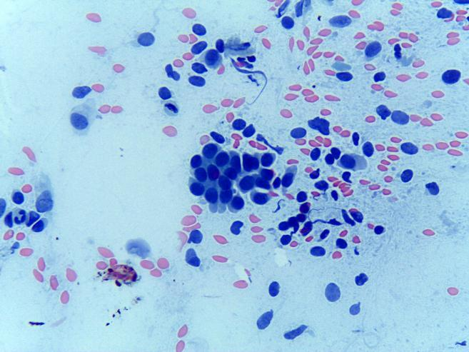
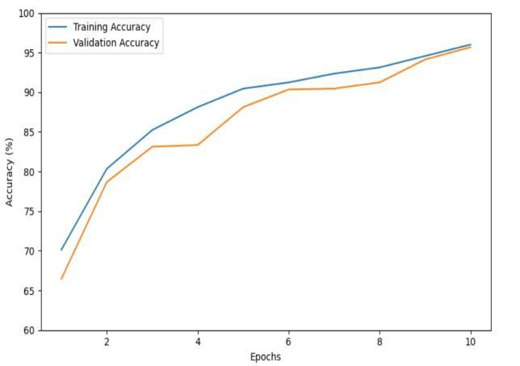
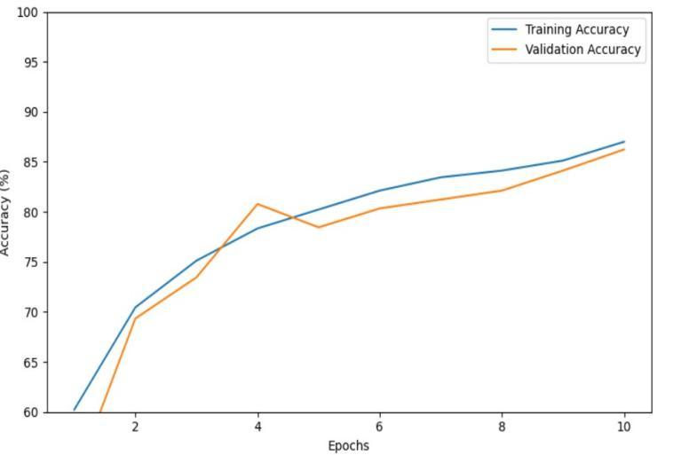
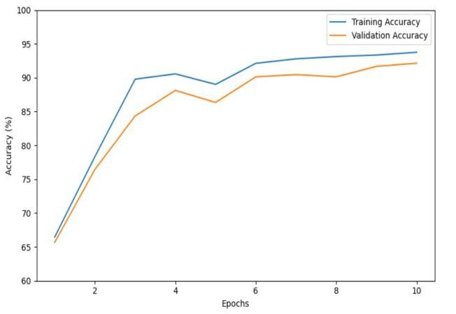
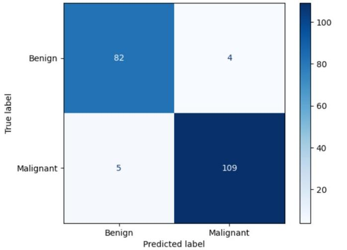
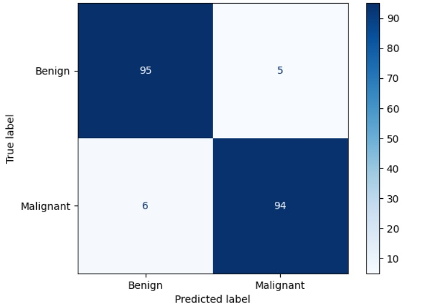
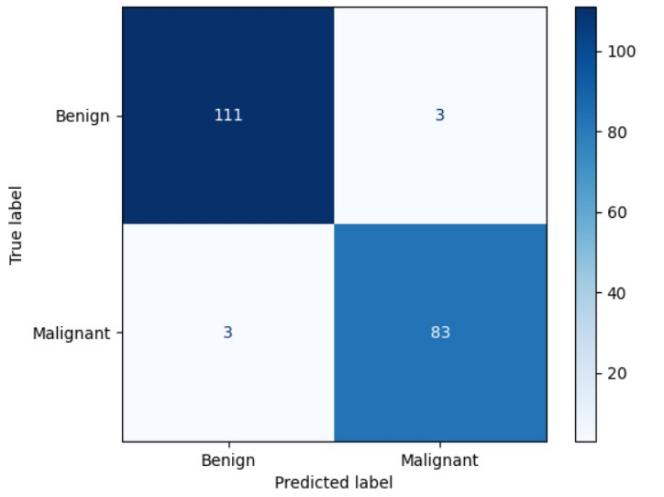

# 🧠 Breast Cancer Cell Classification using Deep Learning

This project focuses on classifying **benign** and **malignant** breast cancer cells using deep learning models trained on an **augmented dataset** of cytological images. We employed state-of-the-art CNN architectures like MobileNetV2, InceptionV3, and DenseNet121 to detect cancerous patterns efficiently.

---

## 📁 Dataset Overview

The dataset consists of cytological images categorized into two folders:
| Benign cells `B` | Malignant cells `M`|
|------------------------|------------------------|
|  |  |

The dataset was augmented and then split into three sets:
- `Train` — 70% (24,507 files)
- `Validation` — 15% (5,285 files)
- `Test` — 15% (5,261 files)

### 🔁 Data Augmentation Techniques Used
To increase data diversity and reduce overfitting:
- ✅ Rotation
- ✅ Horizontal Flip
- ✅ Vertical Flip
- ❌ Grayscale conversion
- ❌ Cropping & Tilting were avoided due to loss of critical cell features

---

## 🧪 Models Used

| Model         | Optimizer | Learning Rate | Input Size | Pretrained |
|---------------|-----------|----------------|------------|------------|
| MobileNetV2   | Adam      | 0.0001         | 224×224    | Yes (ImageNet) |
| InceptionV3   | RMSprop   | 0.00001        | 224×224    | Yes (ImageNet) |
| DenseNet121   | Adam      | 0.0001         | 224×224    | Yes (ImageNet) |

Each model was fine-tuned on our custom dataset after replacing the top classifier layers with new dense layers suitable for binary classification.

---

## ⚙️ Training Configuration

- **Epochs**: 10  
- **Batch Size**: 32  
- **Loss Function**: Binary Crossentropy  
- **Metrics**: Accuracy, Precision, Recall, F1-score  
- **Augmented Data**: Yes  
- **Early Stopping**: Optional, based on validation loss

---

## 📊 Evaluation

Each model was evaluated using:
- Accuracy on test set (15%)
- Classification Report (Precision, Recall, F1-score)
- Confusion Matrix
- Epoch-wise training vs validation loss/accuracy plots

Additionally, inference was performed on randomly selected test images from:
split_data/test/B/
split_data/test/M/

---

## 💾 Model Checkpoints

Trained model weights were saved in `.keras` format. For example:
breast_cancer_inception2.keras 
(DenseNet model was saved using .h5)

These can be used to directly load the model for future inference.

---

## 📈 Performance

| **Architecture** | **Accuracy** | **Precision** | **Recall** | **F1-score** | **Loss** |
|------------------|--------------|---------------|------------|--------------|----------|
| **DenseNet121**  | 96% | 0.94 | 0.93 | 0.93 | 0.12 |
| **MobileNetV2**  | 92% | 0.91 | 0.89 | 0.90 | 0.18 |
| **InceptionV3**  | 87% | 0.88 | 0.85 | 0.86 | 0.25 |

### 🎯 Accuracy Graphs

| **DenseNet121** | **InceptionV3** | **MobileNetV2** |
|-----------------------------------|-----------------------------------|-----------------|
|  |  |  |

### 📚 Confusion Matrices

| **DenseNet121** | **InceptionV3** | **MobileNetV2** |
|----------------------------|-----------------------------|-----------------------|
|  |  |  |

---

## 🚀 How to Run

**1. Clone the repository** 
  
  git clone https://github.com/BirajDas27/Breast_cancer_detection_system_training.git 
  cd Breast_cancer_detection_system_training

**2. Set up your virtual environment** 
  
  python -m venv venv 
  source venv/bin/activate      #for Linux/macOS 
  venv\Scripts\activate         #for Windows

**3. Install dependencies** 
   
  pip install -r requirements.txt

**4. Run training or inference script** 
   
  python train_model.py         #to train 
  python test_model.py          #to test
